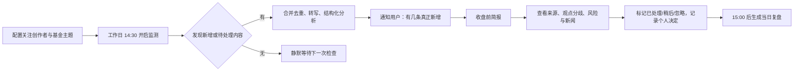

# 基金收盘前信息助手

**文档版本：** v0.1（概念与需求定义）  
**日期：** 2026-07-16  
**阶段：** 文档阶段，暂不进入开发

## 1. 项目结论

这是一个服务于基金投资者的“收盘前信息整理与提醒”产品。它在用户关注的时间窗（默认工作日 14:30-15:00）内，持续汇集指定理财内容创作者的新视频，并将当天遗漏的历史内容、涉及板块、风险提示、新闻线索和原始出处集中呈现。其中，临近 15:00 才发布的视频属于最高优先级信息：系统必须优先发现、即时呈现和提醒，而不能等到下一轮常规汇总。用户无需反复打开抖音刷新，即可在基金申购确认时点前获得可核验的信息全貌。

产品的价值不在于替用户给出买卖结论，而在于：

1. 不漏看：识别关注创作者在关键时间窗内的新内容，以及此前尚未处理的重要内容。
2. 不误读：将“创作者观点”“已核验事实”“系统摘要”明确分层，给每条结论保留来源、发布时间和置信提示。
3. 不打扰：只在用户选择的交易日和时间窗内，以有限频率推送真正有增量的信息。
4. 能行动：在 15:00 前用几分钟完成信息浏览、风险确认和个人决策记录；交易动作仍由用户在原有基金平台完成。

## 2. 背景与痛点理解

### 2.1 当前行为

用户会在 14:30-15:00 之间购买基金，需要观察几位关注的理财博主是否发布视频，再从视频中判断次日基金的可能影响。由于内容可能在这半小时内任意时刻发布，用户只能多次打开抖音查看。其他时间发布、但用户还没看过的内容则容易被遗漏。

### 2.2 核心痛点

| 痛点 | 造成的后果 | 产品机会 |
| --- | --- | --- |
| 需重复进入抖音刷新 | 注意力被打断，仍无法保证及时发现 | 在明确时间窗内主动发现“新增”内容 |
| 只盯当前是否发新视频 | 早些时候的未看视频会被忽略 | 建立待处理内容队列和重要性排序 |
| 视频信息密度低且观点混杂 | 用户难以在 30 分钟内提取板块、风险、新闻 | 将内容转写、结构化摘要、保留原始片段 |
| 多博主说法可能冲突 | 容易把单一观点误当结论 | 按主题聚合观点，展示分歧和依据 |
| 交易截止时间临近 | 最后几分钟容易匆忙下单 | 提前预警、倒计时和决策检查清单 |
| 理财信息可能夸大或过期 | 产生追涨杀跌或误判风险 | 明确时效、来源、非建议声明和风险确认 |

### 2.3 目标用户与边界

**目标用户：** 在中国基金交易日有固定午后决策习惯、关注 3-20 位财经/理财内容创作者的个人投资者。

**不做：**

- 不代替用户执行申购、赎回、调仓或资金划转。
- 不将内容创作者观点包装成确定收益、个性化投资建议或收益承诺。
- 不绕过内容平台的访问控制、付费墙、登录保护或反爬限制。
- 不以未经核验的传闻触发高优先级交易提示。

## 3. 产品目标与衡量方式

### 3.1 目标

1. 让用户在关键 30 分钟内不必手动刷新内容平台。
2. 让用户在首次打开产品后 3 分钟内了解当天“有何新信息、哪些未处理、可能影响什么”。
3. 把创作者观点与事实依据清晰区分，降低信息误导与遗漏风险。
4. 形成可回看的个人决策记录，帮助用户复盘“当时知道什么、基于什么作出决定”。

### 3.2 北极星指标

`关键时间窗内完成信息闭环的活跃用户占比`：在 14:30-15:00 首次进入后，已浏览当天高优先级内容并完成“忽略/稍后/已处理/记录决策”之一的用户占比。

### 3.3 MVP 验收指标（上线后 4 周）

| 指标 | 目标 | 说明 |
| --- | --- | --- |
| 新内容发现时效 | 90% 在可用数据源发布后 5 分钟内入队 | 平台授权能力不足时需降级并标示 |
| 临盘内容发现时效 | 14:50-15:00 发布的高优先级内容，90% 在可观察到后 2 分钟内进入简报 | 以官方/授权数据源实际可见时间为起点；不对平台未开放的数据作虚假承诺 |
| 关键窗内容漏看率 | 低于 10% | 指用户事后打开过、但关键窗未出现的高优先级内容 |
| 摘要可用率 | 85% 以上 | 用户不需打开原视频即可判断是否值得观看 |
| 通知有效率 | 40% 以上 | 收到通知后进入产品查看增量的比例 |
| 风险确认覆盖率 | 100% | 涉及操作倾向的内容必须展示风险与来源 |

## 4. 产品定位与原则

### 4.1 定位

“基金收盘前的个人信息中枢”，而不是“荐基工具”或“自动交易工具”。

### 4.2 设计原则

1. **增量优先：** 首页先回答“自上次查看以来新增了什么”。
2. **来源可追：** 每条摘要都可回到视频/文章/公告原链接及对应时间点。
3. **事实与观点分离：** 用户一眼可区分创作者表达、公开新闻与系统归纳。
4. **时效透明：** 显示发布时间、抓取时间、市场日期和交易截止倒计时。
5. **风险先行：** 对高波动板块、未经证实消息、过期内容、利益冲突内容提高警示，不强化情绪化语言。
6. **用户掌控：** 用户自主选择博主、时间窗、提醒强度和关注主题；可以随时删除数据与关闭提醒。

## 5. 核心用户旅程



### 5.1 首次使用

1. 用户选择市场与交易日历（默认中国内地基金交易日）。
2. 用户添加关注创作者：优先通过平台官方可授权的关注列表导入；无法接入时可粘贴主页链接或手工创建观察清单。
3. 用户选择关注主题：如半导体、AI、医药、红利、黄金、债券、海外市场等；可关联自己持有或关注的基金标签，但不要求导入账户资产。
4. 用户设置提醒：默认工作日 14:30 开始、14:45 汇总、发现高优先级内容时即时提醒、14:55 最后提醒。
5. 用户阅读并确认产品仅整理信息、不提供投资建议。

### 5.2 日常关键流程

| 时间 | 系统行为 | 用户体验 |
| --- | --- | --- |
| 全天 | 合法来源范围内同步内容元数据；整理未处理内容 | 不主动打扰 |
| 14:30 | 打开“收盘前模式”，对候选来源高频更新 | 收到一条“今日简报已就绪”通知（仅在有内容时） |
| 14:30-14:49 | 发现新增内容后去重、提取主题、判断时效与风险 | 每条真正重要的增量以通知或站内红点呈现 |
| 14:45 | 汇总当前最相关的 3-5 条信息 | 用户可在简报页快速扫读 |
| 14:50-15:00 | 进入“临盘优先”模式：缩短检查间隔；新视频直接插入简报顶部，不等待汇总批次 | 对用户标记为重点的博主及高相关主题，发送即时提醒；每条显示精确发布时间和到期倒计时 |
| 14:55 | 给出未处理内容和交易截止倒计时 | 仅提醒一次；但不影响之后发现的临盘新视频即时进入简报 |
| 15:00 后 | 停止“收盘前”即时推送，生成可回看时间线 | 可复盘，不鼓励盘后冲动决策 |

## 6. MVP 功能需求

### P0：必须具备

| 模块 | 需求 | 验收条件 |
| --- | --- | --- |
| 创作者观察清单 | 新增、编辑、删除创作者；设置优先级与主题标签 | 用户可维护 3-20 个来源；变更立即影响简报 |
| 内容收集 | 在平台授权/API/用户明确提供链接允许的范围内获取公开内容元数据 | 记录来源、链接、发布时间、采集时间与授权状态 |
| 博主视频时间线 | 以单个博主为维度展示全部已入库视频，按发布时间倒序排列；可切换查看“临盘发布”“未处理”“已处理” | 每张卡显示发布时间、采集/入库时间、时长、标题、处理状态与关联主题；支持按日期范围筛选 |
| 原视频播放入口 | 每条视频保留原始链接；用户点击后在平台原页面、官方 WebView 或获准嵌入播放器中观看 | 明确显示平台与外链状态；不绕过登录、付费或平台播放限制，不擅自下载/保存视频文件 |
| 字幕与文本检索 | 对可合法处理的视频生成带时间戳的音频转文本字幕，并允许在博主时间线与详情内搜索关键词 | 字幕段落可点击定位原视频对应时刻；低置信度转写标记“待核对”，无权限/无音轨时说明不可用 |
| 未处理队列 | 汇集当天新增和过去 N 天未处理内容 | 同一视频不会重复出现；用户可标为已处理、稍后、忽略 |
| 收盘前简报 | 展示新增数、待处理数、按重要度排序的内容卡片 | 首屏可在 3 分钟内完成扫读；显示 15:00 倒计时 |
| 内容结构化 | 提取标题、核心观点、涉及板块、提及基金/指数、风险语句、新闻线索 | 每项均标注“创作者观点”或“系统提取”，并可跳转原内容 |
| 通知编排 | 14:30 启动、重要新增即时、14:45 汇总、14:55 最后提醒 | 同一来源的多条内容合并通知；每日最多 3 条默认推送 |
| 临盘优先监测 | 14:50-15:00 对重点博主和相关主题采用更短检查间隔；新视频不进入等待合并队列 | 可观察到后目标 2 分钟内置顶至简报；通知明确“临盘新增”，附发布时间、来源和剩余时间 |
| 风险与合规 | 非投资建议提示、来源标记、风险等级、过期提醒、举报/纠错入口 | 涉及操作倾向的卡片必须显示风险提示与发布日期 |
| 个人决策记录 | 记录“看过什么、关注什么、最终不操作/观察/已在外部完成操作” | 仅记录用户选择，不直接发起交易；支持删除 |

### P1：验证价值后加入

- 主题聚合：把不同创作者关于同一板块的观点放在同一页，展示一致与分歧。
- 新闻核验：接入正规公开新闻或公告源，对视频中提到的事件提供“已找到来源 / 未核验”。
- 自定义重要性：用户可提高自己持有相关主题、指定创作者、突发监管/政策信息的优先级。
- 语音简报：在关键时间窗内播放 60-90 秒的事实与观点摘要。
- 周度复盘：呈现信息来源、个人决策和后续市场表现，但不暗示因果或推荐策略。

### P2：谨慎探索

- 在用户明确授权且符合法规及平台规则的前提下，导入持仓的基金名称和主题暴露，用于“相关性提示”。
- 模拟情景卡：展示某板块新闻可能影响的基金类型、历史波动范围和反向风险，不输出买卖指令。
- 多平台内容源：视频号、B站、微信公众号等，优先使用官方或授权能力。

## 7. 信息卡片与重要性规则

### 7.1 信息卡片结构

每条内容卡片按以下顺序呈现：

1. **状态与时效：** “新增”“未处理 2 天”“发布时间 14:42”“距截止 18 分钟”。
2. **来源：** 创作者名称、平台、原内容链接、是否为已验证账号。
3. **一句话摘要：** 中性复述，不使用“必涨”“抄底”等确定性表述。
4. **内容拆分：** 涉及板块/基金或指数/事件；创作者观点；可核验事实；风险提示。
5. **证据入口：** 原视频、时间戳、新闻或公告链接；缺失则标注“未核验”。
6. **操作：** 查看原内容、稍后、已处理、忽略、纠错。

### 7.2 排序模型（可解释，不直接给买卖分）

内容优先级由以下因素组成：

| 因素 | 作用 | 限制 |
| --- | --- | --- |
| 新鲜度 | 越接近当前交易窗口，优先级越高 | 超过用户设定天数自动降级 |
| 临盘发布 | 14:50-15:00 内发布的内容获得“临盘新增”标识并固定置顶 | 置顶只代表时间敏感，不代表观点更正确或应当交易 |
| 用户相关性 | 与用户关注主题、基金标签匹配则上升 | 不因用户资产规模提升权重 |
| 来源偏好 | 用户手工设为高优先级的创作者更靠前 | 不等于内容正确性评分 |
| 事实可核验性 | 有正规新闻、公告或多来源佐证时更易优先呈现 | 必须展示核验来源，不以模型判断代替证据 |
| 风险信号 | 高波动、政策不确定、传闻、利益冲突会显著提示 | 风险提高不代表推荐交易 |
| 重复度 | 同一事件被多条内容提及则合并 | 保留不同创作者的分歧 |

**明确禁止的排序信号：** 以“预测涨跌准确率”形成推荐榜、依据情绪化标题提高曝光、以用户频繁交易历史诱导下单。

## 8. 页面与交互设计

### 8.1 页面结构

| 页面 | 核心内容 | 关键操作 |
| --- | --- | --- |
| 今日简报 | 新增、待处理、交易倒计时、主题概览 | 打开卡片、筛选新增/未处理/高风险 |
| 博主主页/视频时间线 | 某一博主的所有已入库视频、日期分组、临盘标记、字幕状态和处理状态 | 选择时间范围、搜索字幕、按临盘/未处理筛选、打开原视频 |
| 内容详情 | 原内容、摘要、观点与事实分层、风险、关联主题 | 查看原链接、处理状态、纠错 |
| 主题页 | 同一板块的多来源观点与新闻线索 | 比较观点、筛选时效、查看分歧 |
| 观察清单 | 创作者、主题、优先级、来源连接状态 | 添加/编辑/暂停来源 |
| 提醒设置 | 时间窗、交易日、频率、静默规则 | 开关与预览通知 |
| 决策记录 | 当日已看信息和个人备注 | 记录/删除/导出个人数据 |

### 8.2 今日简报线框

```text
--------------------------------------------------
  今日收盘前简报                    截止 15:00 | 22:18
  自上次查看以来：3 条新增，2 条待处理
--------------------------------------------------
  [新增] 博主 A · 14:42 · 半导体
  摘要：讨论今晚海外行业财报可能带来的情绪影响
  创作者观点：偏谨慎      可核验事实：等待确认
  风险：海外市场收盘前信息不完整                 [查看]
--------------------------------------------------
  [未处理 1 天] 博主 B · 医药
  摘要：回顾某政策新闻及可能影响的方向
  已核验：新闻原文链接                              [查看]
--------------------------------------------------
  主题速览：半导体（2 条，观点分歧） 医药（1 条）
--------------------------------------------------
```

### 8.3 博主视频时间线线框

```text
--------------------------------------------------
  博主 A 的视频时间线             [近 7 天 v] [搜索字幕]
  关注主题：半导体、AI          最近同步：14:58
--------------------------------------------------
  07/17（周四）
  [临盘新增] 14:56 发布 · 14:57 入库 · 03:18
  标题：……                    字幕：已生成（98%）
  “02:14 提到半导体板块……”
  [播放原视频] [查看字幕] [标记已处理]

  14:42 发布 · 14:43 入库 · 05:32
  标题：……                    字幕：已生成（91%）
  [播放原视频] [查看字幕] [稍后]
--------------------------------------------------
  07/16（周三）
  11:20 发布 · 11:23 入库 · 04:08 · 已处理
  [播放原视频] [查看字幕]
--------------------------------------------------
```

### 8.4 字幕与原视频交互要求

1. 时间线的“发布时间”使用内容平台的原始发布时间；“入库时间”使用本产品首次发现并记录该内容的时间。两者必须同时展示，避免把发现延迟误解为视频发布时间。
2. 点击“播放原视频”优先跳转至内容平台原页面；仅当平台规则和技术能力允许时使用官方嵌入播放。页面需提示用户可能需要在原平台登录。
3. 点击“查看字幕”进入逐段文本视图。每段显示起止时间，例如 `02:14–02:27`；点击该段时，原视频跳转或尝试定位到对应位置。
4. 字幕搜索返回命中的上下文，而不是只返回关键词；可按“全部视频 / 临盘视频 / 未处理视频”限定范围。
5. AI 转写内容与原视频分开展示，标注生成状态、语言和置信度；用户可报告错字、断句错误或错误归因。

### 8.5 通知文案原则

- 只传递事实性增量：`“14:42，观察清单新增 1 条半导体相关视频，已加入今日简报。”`
- 临盘新视频单独标识：`“临盘新增：重点博主于 14:56 发布 1 条内容，距参考截止时间 4 分钟。已置顶，建议查看来源与风险。”`
- 不使用交易指令：禁止 `“立即买入”“最后机会”“必涨”` 等表达。
- 通知中不塞入复杂结论；点击后先进入带来源与风险的详情。
- 当多个内容同时出现时合并：`“2 位创作者新增 3 条内容，涉及半导体和医药。”`

### 8.6 Web 端设计规范

首版采用**桌面 Web 优先**的三栏信息工作台：左侧是导航与观察清单，中间是今日简报/博主时间线等主工作区，右侧固定显示参考截止倒计时、临盘新增与待处理信息。视觉采用深色 Glassmorphism：深色氛围背景、半透明玻璃面板、`backdrop-filter: blur(20px)`、柔和边缘高光与薄荷绿 `#8AFFC4` 重点色。具体页面、响应式布局、组件令牌和交互规则见《基金收盘前信息助手_Web端视觉与布局方案》。

### 8.7 转写任务体验要求

音频转文字采用异步任务流：校验可处理的音频/链接 → 创建转写任务 → 查询进度 → 获取文本 → 再生成摘要与结构化信息。界面必须显示“等待处理、转写中、完成、低置信度、失败、不可处理”状态和时间，不能把转写作为同步阻塞操作。临盘视频一经发现即可提醒与入库，字幕完成后再非打断式更新；不得因等待转写而错过 15:00 前的内容提示。

## 9. 数据、内容与技术约束

### 9.1 数据对象

| 对象 | 关键字段 | 保留策略 |
| --- | --- | --- |
| 创作者 | 平台 ID/主页链接、昵称、优先级、主题、授权状态 | 用户删除清单后停止采集；按策略清除关联个人配置 |
| 内容 | 平台内容 ID、原始链接、发布时间、首次发现/入库时间、时长、标题、封面、转写/摘要、处理状态 | 原始内容以平台链接或获准嵌入播放为准；避免不必要地长期复制受版权保护视频文件 |
| 字幕片段 | 内容 ID、段落序号、起止时间、转写文本、置信度、语言、生成时间、纠错状态 | 在授权范围和用户选择的保留期内保存；删除内容或失去处理依据后应同步清理 |
| 结构化信息 | 主题、实体、观点、事实、风险、证据链接、模型版本 | 支持溯源、纠错和重新处理 |
| 用户偏好 | 时间窗、提醒、标签、处理状态 | 可导出、可删除、默认最小化收集 |
| 决策记录 | 日期、备注、用户主动选择的结果标签 | 不记录券商账号、交易密码或资金明细 |

### 9.2 平台与内容合规策略

1. 首选内容平台正式开放能力、合作接口或用户授权的数据导入方式；上线前逐项确认抖音及其他平台的开发者条款。
2. 若平台不提供合法、稳定的订阅/新内容通知能力，MVP 不能承诺实时自动发现。可降级为用户手工转发链接、浏览器/系统分享进入收件箱，或由用户启用的平台原生通知后聚合处理。
3. 不抓取私密内容、不规避登录/验证码/频率限制，不保存超出产品必要范围的原始视频副本。原视频默认只存链接及必要元数据；在线播放采用平台原页面或平台允许的嵌入能力。
4. 引用新闻、公告时记录来源 URL、发布时间、抓取时间；对无法验证的内容标“未核验”，而不是判定真伪。
5. 对音频转文字、字幕存储和搜索能力，需逐项确认平台条款、著作权和个人信息处理要求。无合法处理基础时，仅提供原视频链接与用户手工备注，不生成或保留字幕。

### 9.3 AI 使用边界

- AI 仅用于转写、摘要、主题识别、风险词检测、相似内容归并和来源提示。
- 摘要必须可回链到原内容；无法转写或低置信度时展示原文标题与“需查看原内容”。
- 模型不能把推测改写为事实，不能生成目标收益、买卖时点或个人化仓位建议。
- 对涉及监管、重大政策、财务数据的关键事实，应优先使用可验证来源或人工审核流程。

## 10. 风险、合规与安全要求

| 风险 | 产品控制 |
| --- | --- |
| 被理解为投顾服务 | 全程标注“信息整理，不构成投资建议”；不生成交易指令；合规评审业务模式和文案 |
| 平台规则或版权风险 | 使用官方/授权能力；只显示必要的元数据和短摘要；回链原内容 |
| AI 幻觉或断章取义 | 显示原出处和时间戳；事实/观点分层；低置信度降级；提供纠错入口 |
| 突发内容诱导冲动交易 | 风险提示、冷静提示、限制煽动性通知；不提供一键交易 |
| 用户隐私泄露 | 最小化采集、加密存储、访问控制、可导出/删除；不采集交易密码或账户凭据 |
| 交易日与截止时点不一致 | 使用可配置交易日历；明确“以基金销售平台规则为准”，特殊基金/跨境基金单独提示 |

特别说明：通常所说的 15:00 是许多中国内地公募基金交易日的申购/赎回确认临界时间，但具体以基金合同、代销平台和市场交易日安排为准。产品应显示“参考截止时间”，不得替代交易平台确认。

## 11. 最佳实践方案

### 11.1 建议的产品策略

采用“**全天低频入队 + 收盘前高频整理 + 临盘即时优先 + 有限通知 + 事后复盘**”五层机制：

1. **全天低频入队：** 将新内容先入待处理队列，不打断用户；确保早上或午间发布的视频不会被忽略。
2. **收盘前高频整理：** 14:30 后缩短合法数据源的检查间隔，只有产生有效增量才更新简报。
3. **临盘即时优先：** 14:50-15:00 对重点博主/重点主题启用更高优先级队列；只要发现新内容，先显示“临盘新增”卡片与完整来源，再做后续主题聚合，避免因 AI 处理或通知合并而延迟。
4. **有限通知：** 常规内容默认最多 3 次；临盘优先内容拥有独立的紧急额度，但同一博主的连续发布仍合并，避免通知轰炸。
5. **事后复盘：** 15:00 后保留时间线和决策备注，帮助用户审视信息质量，而非用短期涨跌强化不稳健行为。

### 11.2 建议的首版范围

首版应把“可靠的信息整理体验”做扎实，而非过早做复杂的荐基能力：

- 支持 5-10 位创作者、3-8 个主题、当天与过去 7 天的未处理内容。
- 用规则 + AI 摘要构建内容卡片，所有结论可点击回到原始内容。
- 先以一个合规、稳定的内容接入路径验证需求；平台自动监测无法合法接入时，优先做“链接收件箱 + 收盘前智能简报”。
- 用户通过“已处理/忽略/相关/不相关”反馈训练个人排序偏好，避免用交易结果直接优化内容推荐。

### 11.3 不建议的做法

- 直接把多位博主的观点投票成“买/卖”信号。
- 用 14:55 的强刺激倒计时催促决策。
- 把没有来源的传闻、标题党和高风险预测作为即时推送。
- 未获得平台许可就以爬虫承诺抖音实时监控。
- 以净值涨跌反推某位创作者“准确”，忽略时间、样本量、风险调整收益和幸存者偏差。

## 12. 实施路线与决策门

| 阶段 | 周期建议 | 目标 | 进入下一阶段的条件 |
| --- | --- | --- | --- |
| 0. 需求验证 | 1-2 周 | 访谈 5-10 位目标用户，验证关键时间窗、内容源和愿付出成本 | 确认“漏看”比“交易建议”更值得解决 |
| 1. 原型测试 | 1-2 周 | 完成今日简报、内容卡片、提醒设置的可点击原型 | 用户能在 3 分钟内完成信息扫读 |
| 2. 数据可行性 | 1-3 周 | 确认每个平台的合规数据接入与时效 | 至少有一个稳定合法的内容入库路径 |
| 3. MVP | 4-6 周 | 上线观察清单、收件箱、简报、通知、风险分层 | 达到核心时效和内容可用率指标 |
| 4. 优化 | 持续 | 加入主题聚合、新闻核验与复盘 | 留存、通知有效率和纠错率达标 |

## 13. 需在启动前确认的事项

1. **内容接入：** 是否有抖音官方或合作的数据接入资格；若没有，用户是否接受首版用“手工分享链接 + 聚合整理”验证需求。
2. **产品形态：** 首版确定为桌面 Web 优先，以三栏工作台满足视频、字幕、来源和时间线并读的需求；临盘提醒由浏览器通知承担。移动端作为响应式阅读和提醒补充，不作为首版主战场。
3. **目标范围：** 第一阶段是否只支持公募基金相关主题，还是同时覆盖股票、ETF、黄金等内容；建议先聚焦基金主题。
4. **合规路径：** 上线前需要由具备资质的法律/合规人员审查产品定位、AI 文案、数据来源和是否触及证券期货投资咨询或基金投顾规则。
5. **成功定义：** 首轮试点应衡量“少刷新、少遗漏、能快速理解”，不以短期收益或交易频率作为成功指标。

## 14. 下一步产出建议

在确认上述启动事项后，下一轮文档可依次补齐：

1. 用户访谈提纲与 5-10 位用户的验证问卷。
2. 基于《基金收盘前信息助手_Web端视觉与布局方案》完成可点击原型与页面级交互说明。
3. 内容接入合规调研清单及数据源可行性结论。
4. MVP 的用户故事、验收标准与埋点方案。
